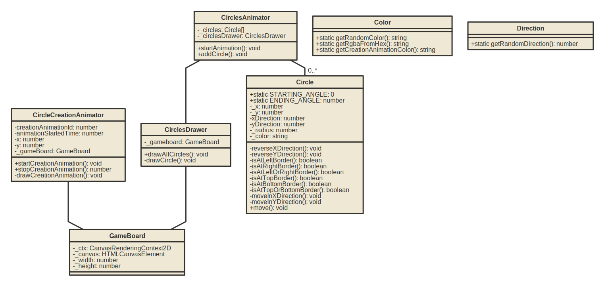
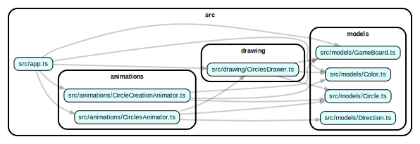

# physics

To start the project, run the following command:

```bash
npm start
```

## class diagram

The class diagram can be generated with the following command:

```bash
npm run generate:class-diagram
```



## dependency diagram

The dependency diagram can be generated with the following command:

```bash
npm run generate:dependency-diagram
```

